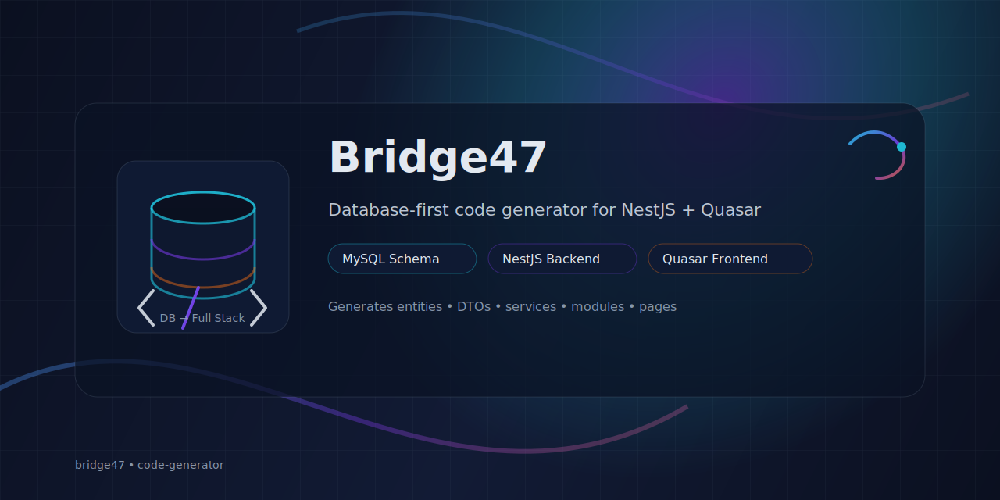

<p align="center">
  
</p>

# Bridge47 - Code Generator

Bridge47 is a powerful code generation tool designed to speed up the development of full-stack applications. It generates a production-ready **NestJS backend** and **Quasar (Vue.js) frontend** directly from your MySQL database schema.

## Features

- **Database First**: Generates entities, DTOs, and services based on your existing MySQL tables.
- **Full Stack Generation**:
  - **Backend**: NestJS with TypeORM, JWT authentication, RBAC (Roles), logging, and more.
  - **Frontend**: Quasar framework (Vue 3) with generated API clients and UI components.
- **Customizable Templates**: Includes `template-backend` and `template-frontend` which act as the base for generation.
- **Secure & Production Ready**:
  - Backend includes setup for ClamAV (virus scanning) and Redis (caching), togglable via `.env`.
  - Secure authentication flow awaiting your configuration.

## Project Structure

- `src/`: Core generator logic (TypeScript).
- `template-backend/`: The base NestJS application template.
- `template-frontend/`: The base Quasar application template.
- `database/`: Database utility scripts.

## Getting Started

1.  **Clone the repository**:

    ```bash
    git clone https://github.com/nextera-one/bridge47.git
    cd bridge47
    ```

2.  **Setup Templates**:
    - **Backend**:
      ```bash
      cd template-backend
      cp .env.example .env
      npm install
      npm run start:dev
      ```
    - **Frontend**:
      ```bash
      cd template-frontend
      npm install
      npm run dev
      ```

3.  **Run the Generator**:
    - Configure your database connection in `src/generator.config.ts` (or equivalent config).
    - Run the generator script (add specific instructions here once finalized).

## License

MIT License. See [LICENSE.md](LICENSE.md).
